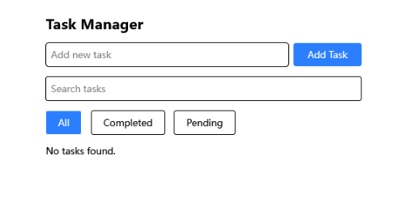
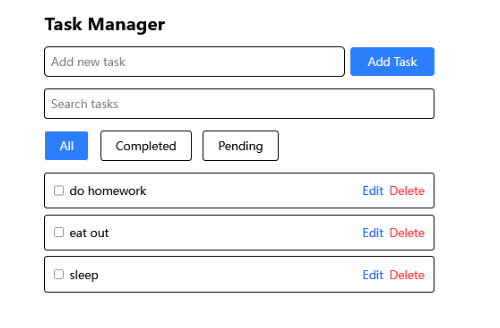
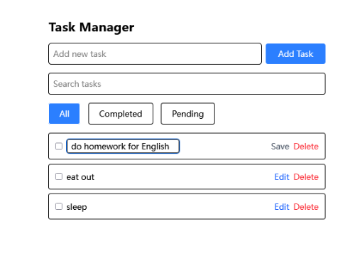
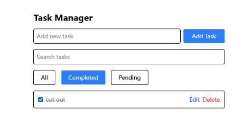
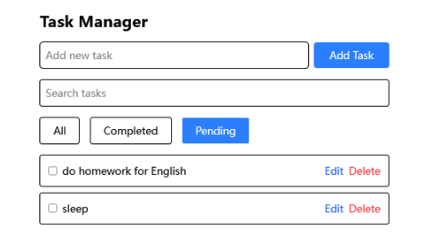
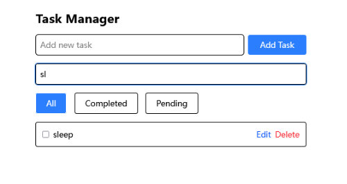
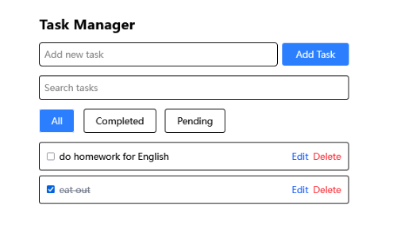

# Task Manager App

A simple task management application built with React and Redux Toolkit.
Allows users to add, edit, delete, and filter tasks.

---

## Features

- Add new tasks
- Edit existing tasks
- Mark tasks as completed/uncompleted
- Delete tasks
- Filter tasks by status and search term
- Save tasks to browser localStorage


##Technologies Used

- React

- Redux Toolkit

- JavaScript (ES6+)

- localStorage for data persistence


## Usage


```bash
cd task-manager-app
```
```bash
npm run dev
```

## Screenshots

### Default App View
Displays the default task list interface when the app loads.



---

### Adding a New Task
Shows the user inputting a new task into the list.



---

### Editing a Task
Illustrates editing an existing task's text.



---

### Filtering Tasks by Status
Demonstrates filtering tasks (e.g., all, completed, pending).



---

### Filtering to Show Only Pending Tasks
Highlights filtering specifically for pending tasks.



---

### Searching Tasks
Shows the search functionality filtering tasks by keywords.



---

### Deleting a Task
Demonstrates removing a task from the list.

